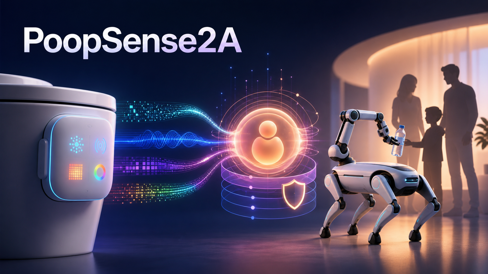

# PoopSense｜便感智护

> 从一次感知，到一次真实的健康行动。



PoopSense 是一套面向家庭健康照护场景的隐私优先型智能硬件系统。BME688、APDS9960、MLX90640 和 AS7341 分别采集气体响应、接近状态、热成像形状特征与颜色信息；ESP32 统一读取后，经 USB Serial 交给电脑端 Python Adapter 完成特征处理、分类和 Session JSON 封装。软件端由主 Agent 联合健康医生、生活教练、家庭管家、安全仲裁、主动关怀和社交社区 Agent，结合长期记忆与个人趋势生成易理解、可执行的建议；经过用户确认和安全检查后，系统通过 Tooling 调用机械臂、VBot 和提醒机器人，将健康建议转化为现实行动。

PoopSense 不替代医疗诊断。系统将传感事实、规则判断、模型解释和现实设备动作分层处理，让模型负责解释与编排，确定性代码负责风险边界、权限和动作安全。

## 为什么做 PoopSense

- 老人和儿童很难长期、主动地记录排便及身体变化。
- 家庭照护者通常只能依赖零散描述，难以及时了解长期趋势。
- 传统健康产品容易堆叠指标，却没有把建议转化为真正发生的行动。
- 用户既需要长期关怀，也需要明确的数据授权、静默时段和隐私边界。

## 从感知到行动

```text
BME688 / APDS9960 / MLX90640 / AS7341
                    ↓
                  ESP32
                    ↓ USB Serial
        Python Adapter → Session JSON
                    ↓
      PoopSense App → 主 Agent 与专业 Agent
                    ↓
          安全仲裁 + 用户明确确认
                    ↓
   机械臂取杯 → VBot 命名路线 → 机械臂递水
                    ↓
             任务结果与审计
```

## 六层系统架构

- **感知层**：BME688 气体响应，APDS9960 接近状态，MLX90640 热成像形状特征，AS7341 颜色特征。
- **嵌入式层**：ESP32 管理传感器、采集状态和基础预处理。
- **边缘计算层**：MacBook/边缘设备上的 Python Adapter 负责解析、特征提取、分类、融合、质量评估和 JSON 封装。
- **应用层**：PoopSense App 展示 Session、动画反馈、个人趋势并提供用户交互。
- **智能决策层**：主 Agent、专业 Agent、长期记忆与安全仲裁共同生成可执行任务。
- **执行层**：提醒机器人、VBot 与 Panthera 机械臂完成提醒、移动、取杯和递水，并回传执行结果。

机器人递水工作流：

```text
补水建议 → 用户确认 → 待机位 → 取水预备位 → 取水位
→ 夹紧 → 提起/安全运输位 → VBot 命名路线 → 递水预备位
→ 递水位 → 用户接杯确认 → 松爪 → 返回待机位 → 结果反馈
```

## Agent 架构

- **主 Agent**：理解用户请求、组织最小授权上下文并进行任务编排。
- **健康医生 Agent**：解释结构化结果、历史趋势和需要关注的变化。
- **生活教练 Agent**：把结果转化为饮水、饮食、运动与生活建议。
- **安全仲裁 Agent**：以确定性规则检查风险、权限和机器人动作条件。
- **家庭管家 Agent**：管理成员、数据认领、查看授权和家庭协作。
- **主动关怀 Agent**：遵守静默时段和频率限制，发起适度的主动提醒。
- **社交/社区 Agent**：在用户明确授权下以 Agent 化名交流和建立连接。
- **记忆与 Soul**：保存自报信息、传感事实、反馈偏好、语气和关系目标。
- **Tooling**：封装趋势查询、家庭授权、机械臂、VBot 和提醒机器人能力。

详见 [Agent 系统说明](docs/agent-system.md) 与 [系统架构](docs/architecture.md)。

## 已实现能力

- 设备会话接入、版本校验、幂等处理和成员认领。
- 个人类别基线、趋势、连续变化和可靠样本覆盖率。
- 主 Agent 委派、专业 Agent Skill、运行步骤、handoff 和审计记录。
- 长期记忆、Soul 版本、反馈偏好和结构化健康自报。
- 家庭查看授权、撤回、原始数据专项授权与删除状态管理。
- 主动关怀、站内通知、周报、便便宠物和社区/Agent 连接。
- Panthera 固定关节点位取杯、提起、递水轨迹与停止控制。
- VBot 命名路线接口、到站检查、用户接杯确认和递水任务状态机。
- React/PWA 用户界面、动画反馈、趋势、家庭、社区及 Agent 页面。

## 仓库结构

```text
frontend/                  React + TypeScript + Vite 前端
backend/app/               FastAPI、Agent、记忆、授权与机器人 Tooling
backend/tests/             后端测试
backend/migrations/        Alembic 数据库迁移
backend/robot_trajectories/机械臂成功轨迹与演示配置
backend/VBOT_BRIDGE.md      VBot HTTP/ROS 2 桥接契约
hardware/                  传感数据协议与示例数据
docs/                      架构、BOM、安全和演示说明
```

## 快速启动（Windows）

环境要求：Python 3.11+、Node.js 20.19+。

```powershell
git clone https://github.com/koljiu753/poopsense1.git
cd poopsense1

cd backend
python -m venv .venv
.\.venv\Scripts\Activate.ps1
python -m pip install -e ".[dev]"
Copy-Item .env.local.example .env.local

cd ..\frontend
npm ci

cd ..
.\start_demo.ps1
```

浏览器打开 `http://127.0.0.1:5173/`。后端 OpenAPI 文档位于 `http://127.0.0.1:8000/docs`。

模型密钥只写入本地 `backend/.env.local` 或系统环境变量。演示身份凭证只用于本机开发环境，生产部署必须关闭 Demo bootstrap 并接入正式登录。

## 测试

```powershell
cd frontend
npm test
npm run build

cd ..\backend
.\.venv\Scripts\python.exe -m pytest
```

当前版本包含前端组件/交互测试和后端 Agent、授权、隐私、趋势及机器人递水测试；GitHub Actions 会在每次提交时自动执行测试与构建。

## 机器人与硬件

PoopSense 为团队从零设计和开发的原创项目，使用 Panthera-HT 机械臂、VBot 机器狗及相关 SDK 作为通用硬件平台。团队原创完成产品定义、数据链路、Agent 系统、长期记忆、安全仲裁、机器人 Tooling、动作轨迹标定和整体任务流程。

感知器由 BME688、APDS9960、MLX90640、AS7341 与 ESP32 组成。四类传感器的数据经 USB Serial 进入 Python Adapter，并映射为后端现有的 `shape`、`color`、`odor`、`presence_state`、温湿度、置信度和模型版本字段。详细数据契约见 [硬件说明](hardware/README.md)，完整连接关系见 [系统连接图](docs/wiring-diagram.md)。

- [Panthera-HT Main](https://github.com/HighTorque-Robotics/Panthera-HT_Main)
- [Panthera-HT Host](https://github.com/HighTorque-Robotics/Panthera-HT_Host)
- [Panthera-HT SDK](https://github.com/HighTorque-Robotics/Panthera-HT_SDK)

详见 [第三方组件说明](THIRD_PARTY_NOTICES.md)、[硬件说明](hardware/README.md) 和 [BOM](docs/bom.csv)。

## 隐私与安全

- 未认领记录不会自动进入个人趋势。
- 查看授权、编辑权限和原始数据授权相互独立。
- Soul 与模型解释不能覆盖传感事实和确定性风险规则。
- 机器人动作需要明确确认，并支持超时、停止、到位检查和任务审计。
- 社区分享需要显式同意，只使用用户输入的公开内容。
- 仓库不包含真实用户数据、设备密钥或模型 API Key。

详见 [隐私与安全设计](docs/privacy-and-safety.md)。

## 比赛信息

- 团队：**一问便知**
- 项目：**PoopSense｜便感智护**
- 赛道：智能硬件赛道
- 项目类型：从 0 到 1 创新项目
- GitHub Topic：`shenicest-fission`

## License

团队原创代码以 [MIT License](LICENSE) 发布。第三方硬件、SDK、模型和素材分别遵循其原始许可证与使用条款。
