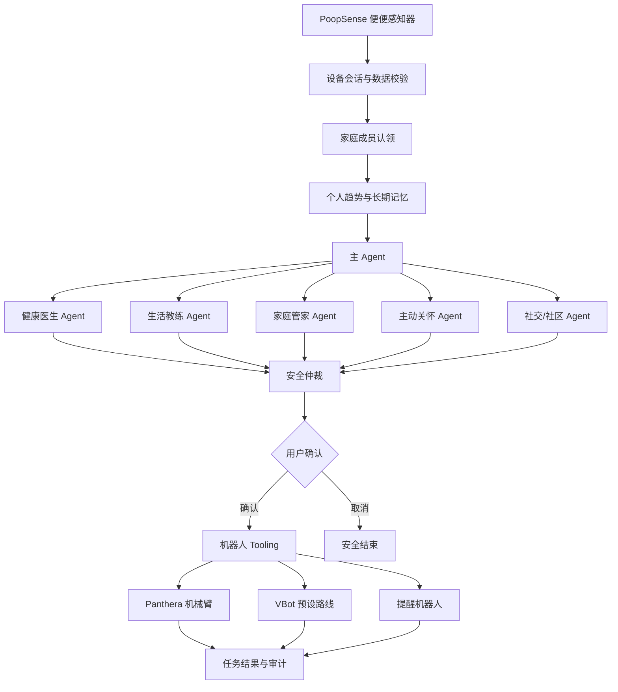

# 系统架构

PoopSense 将传感事实、Agent 推理、确定性安全规则和现实设备动作分层，避免模型直接修改风险等级或越过用户授权。

## 数据层

- 设备事实保持不可覆盖，用户纠正以新版本追加。
- 未认领记录不会自动进入任何家庭成员的个人趋势。
- 趋势只使用已认领且可靠的样本，并返回有效覆盖率。
- PostgreSQL 用作生产事实账本，SQLite 用于本地开发和自动化测试。

## Agent 层

- 主 Agent 根据意图和授权上下文选择专业 Agent 与 Skill。
- 专业 Agent 只获取当前任务所需的最小上下文域。
- 每次运行记录步骤、handoff、Skill 版本、授权依据和结果。
- 模型解释不能覆盖传感事实、权限或确定性安全规则。

## Tooling 层

- 趋势查询、家庭授权与通知等软件工具。
- Panthera 机械臂固定轨迹、停止和状态读取工具。
- VBot 命名路线启动、状态读取和停止工具。
- 用户接杯确认、任务结果和 Agent Action 审计工具。
