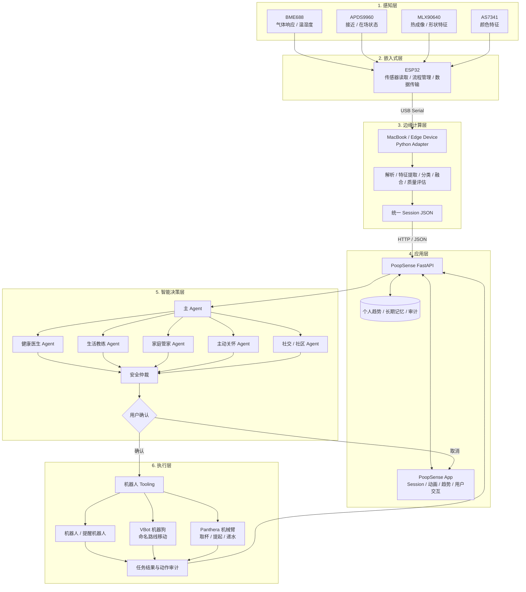

# 系统架构

PoopSense 按照“感知层 → 嵌入式层 → 边缘计算层 → 应用层 → 智能决策层 → 执行层”进行设计，形成“健康感知 → 数据分析 → AI 决策 → 实体执行 → 结果反馈”的闭环。传感事实、Agent 推理、确定性安全规则和现实设备动作相互分层，避免模型直接修改风险等级或越过用户授权。

## 1. 感知层

- **BME688**：采集气体响应及设备环境温湿度，为气味特征分类提供输入。
- **APDS9960**：检测用户或目标是否靠近，辅助启动和结束一次采集 Session。
- **MLX90640**：采集低分辨率热阵列，以不采集可识别人脸图像的方式辅助提取形状特征。
- **AS7341**：采集多通道颜色信息，输出红、绿、黄、蓝等颜色类别与置信度。

## 2. 嵌入式层

ESP32 连接并管理多种传感器，读取实时数据，执行基础预处理与采集状态管理，并通过 USB Serial 将一次检测的数据发送至电脑端。

## 3. 边缘计算层

MacBook 或其他边缘设备运行 Python Adapter，负责串口接收、传感数据解析、特征提取、规则/模型分类、多源结果融合和质量评估，最后输出符合后端契约的 Session JSON。模型分类结果必须携带置信度和模型版本，便于追溯。

## 4. 应用层

PoopSense App 展示本次 Session、颜色/形状/气味分类、动画反馈、个人趋势和 Agent 建议，并提供成员认领、授权、用户确认和任务状态入口。后端保存事实、长期记忆与审计记录。

## 5. 智能决策层

- 主 Agent 根据检测结果、用户请求和授权上下文选择专业 Agent 与 Skill。
- 健康医生、生活教练、家庭管家、主动关怀和社交/社区 Agent 只获取当前任务所需的最小上下文域。
- 安全仲裁使用确定性规则检查风险、权限、频率和机器人动作条件。
- 模型解释不能覆盖传感事实、权限或确定性安全规则。
- 每次运行记录步骤、handoff、Skill 版本、授权依据和结果。

## 6. 执行层

- 趋势查询、家庭授权和通知等软件工具。
- Panthera 机械臂取杯、提起、安全运输、递水、停止和状态读取工具。
- VBot 命名路线启动、状态读取和停止工具。
- 提醒机器人推水与语音提示工具。
- 用户接杯确认、任务结果和 Agent Action 审计工具。

典型补水链路为：健康 Agent 提出补水建议 → 安全仲裁 → 用户确认 → 机械臂取杯并提起 → 返回安全运输位 → VBot 执行命名路线 → 机械臂递水 → 用户接杯 → 机械臂返回待机位 → 系统反馈任务结果。
