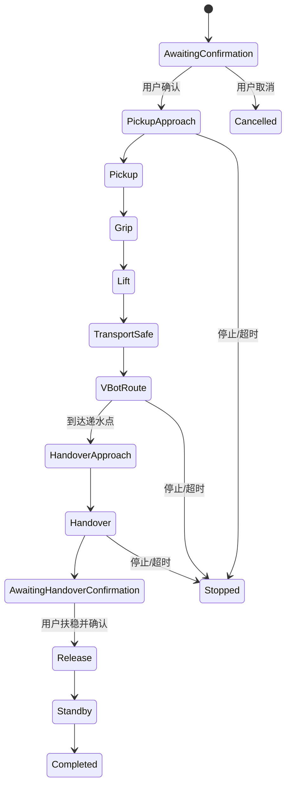

# 机器人 Tooling 与递水工作流

PoopSense 将机械臂和 VBot 封装为标准化工具，由安全仲裁和用户确认控制动作入口。机械臂使用经过实机标定的固定关节点位，VBot 使用命名预设路线。

## 工作流

## 轨迹文件

- `deliver_water_first_success.json`：第一次成功取水轨迹。
- `deliver_water_second_success.json`：第二次成功取水轨迹。
- `deliver_water_agent_verified.json`：Agent 调用验证轨迹。
- `deliver_water.json`：统一递水任务配置。

轨迹文件包含关节位置、夹爪目标和动作参数，不包含设备密钥。

## 主要接口

- `POST /api/v1/households/{household_id}/robot/tasks/pickup-water`
- `POST /api/v1/households/{household_id}/robot/tasks/deliver-water`
- `GET /api/v1/households/{household_id}/robot/tasks/{task_id}`
- `POST /api/v1/households/{household_id}/robot/tasks/{task_id}/confirm-handover`
- `POST /api/v1/households/{household_id}/robot/tasks/stop`

## 安全约束

- 所有真实运动任务都要求显式确认。
- 用户确认扶稳水杯前，递水任务不会松开夹爪。
- 机械臂或 VBot 返回失败、离线或超时时，状态机停止后续动作。
- 停止接口同时向机械臂和 VBot 发出停止请求。
- 任务阶段、失败原因和结果写入 Agent Action 审计。

VBot HTTP/ROS 2 桥接协议详见 [`backend/VBOT_BRIDGE.md`](../backend/VBOT_BRIDGE.md)。
