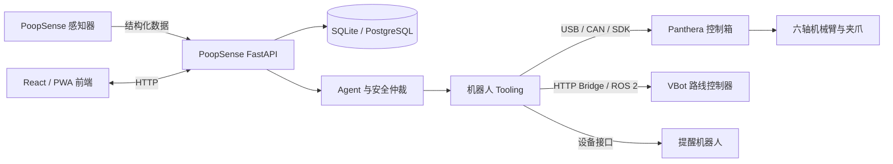

# 系统连接图

## 展机接线说明

- 上位机运行 Windows、WSL、PoopSense 后端和机械臂 Host。
- Panthera 控制箱通过 USB/CAN 与上位机通信，并为关节提供控制链路。
- VBot 通过命名路线接口接收启动、状态和停止请求。
- 感知器通过结构化事件接口向 PoopSense 后端上报数据。
- 各硬件电源、规格和数量以 [`bom.csv`](bom.csv) 为准。
