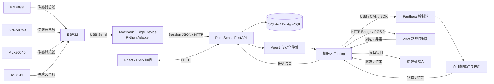

# 系统连接图

## 感知器接线与数据流

- BME688、APDS9960、MLX90640 和 AS7341 连接至 ESP32；具体引脚、电压和总线地址以展机实际原理图及模块规格为准。
- ESP32 负责一次采集流程的开始、传感器读取、基础预处理和串口发送。
- ESP32 通过 USB Serial 与 MacBook/边缘设备连接。
- Python Adapter 完成数据解析、特征提取、分类、质量评估和 JSON 封装，再通过 HTTP 发送至 PoopSense 后端。

## 执行设备接线

- 上位机运行 PoopSense 后端、机器人 Tooling 和机械臂 Host。
- Panthera 控制箱通过 USB/CAN 与上位机通信，并为关节提供控制链路。
- VBot 通过命名路线接口接收启动、状态和停止请求。
- 提醒机器人通过其设备接口接收推水和语音提示任务。
- 电机与控制设备必须共用明确的急停/断电流程；调试时保持低速并清空安全区域。
- 各硬件数量和用途以 [`bom.csv`](bom.csv) 为准。
